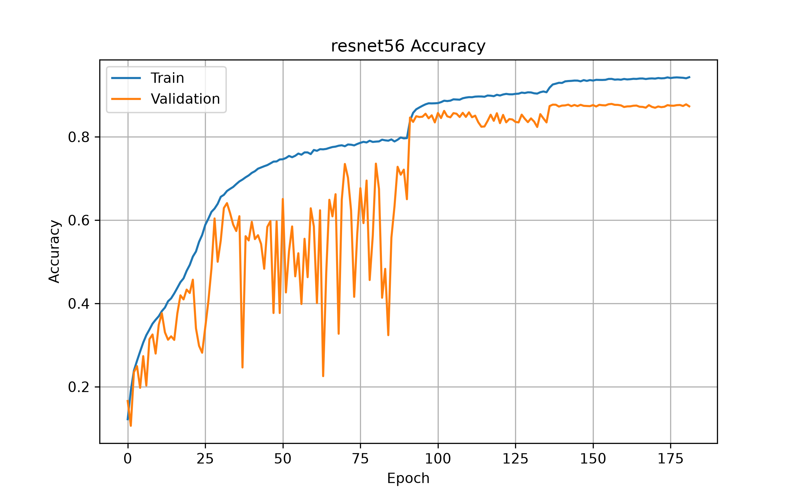
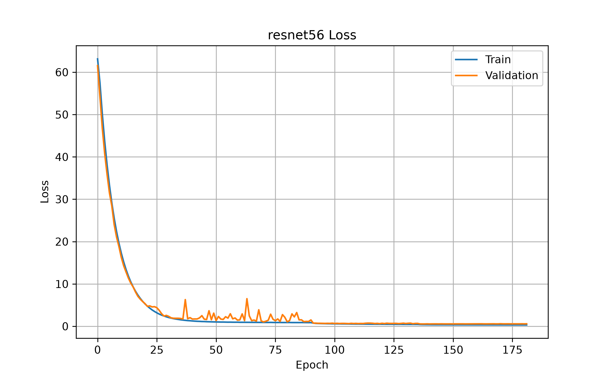
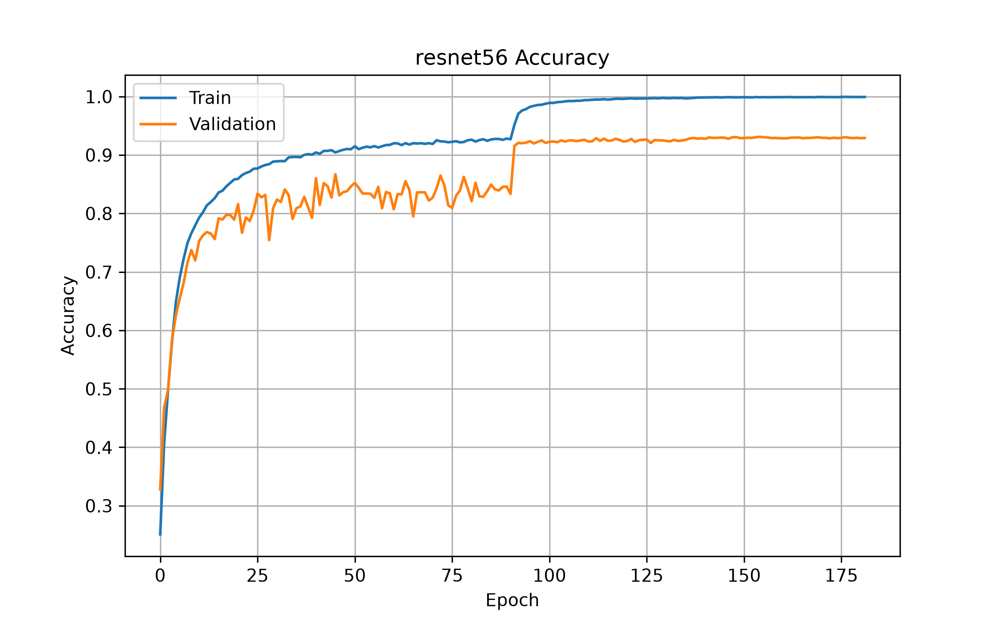
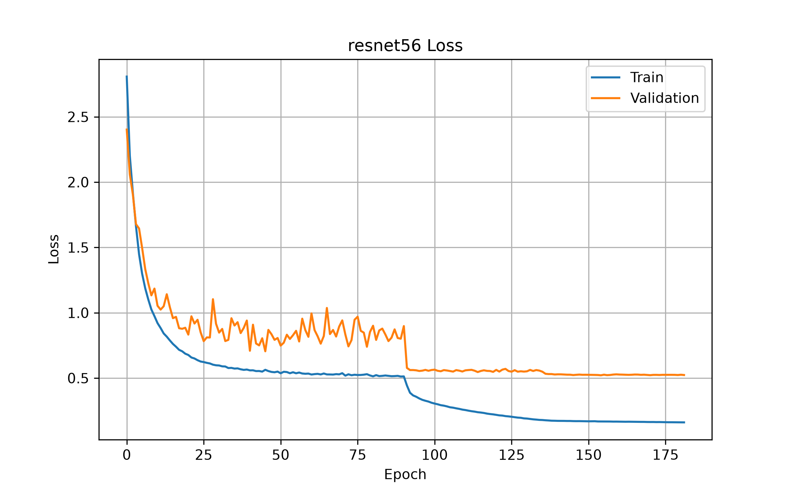

# ResNet-56: Reimplementation of *Deep Residual Learning for Image Recognition*

A faithful TensorFlow/Keras reimplementation of the CIFAR-10 experiments from **Deep Residual Learning for Image Recognition** (He et al., 2015).

Instead of using TensorFlow's built-in ResNet implementation, this project recreates the architecture from scratch to better understand residual learning, identity shortcuts, and the degradation problem in deep neural networks.

A detailed discussion of the implementation, assumptions, challenges, and results can be found in **implementation_report.md**.

---

## Features

- Manual implementation of **Plain-56** and **ResNet-56**
- Original **Option A** identity shortcuts from the paper
- CIFAR-10 preprocessing identical to the paper
- Original learning-rate schedule reproduced from iteration counts
- Training and evaluation scripts
- Saved training history and plots
- Detailed implementation report

---

## Repository Structure

```text
ResNet_Reimplementation/
│
├── additional_images/
├── evaluation/
├── models/
├── results/
├── utils/
│
├── implementation_report.md
├── requirements.txt
├── train.py
└── visualization.py
```

---

## Architecture

The implemented ResNet follows the CIFAR-10 architecture described in the paper.

```text
Input (32×32×3)
        │
        ▼
3×3 Conv (16)
        │
        ▼
Stage 1
9 Residual Blocks
16 Filters
        │
        ▼
Stage 2
9 Residual Blocks
32 Filters
(First block stride = 2)
        │
        ▼
Stage 3
9 Residual Blocks
64 Filters
(First block stride = 2)
        │
        ▼
Global Average Pooling
        │
        ▼
Dense (10)
        │
        ▼
Softmax
```

---

## Results

### Note
The titles of the **Plain-56** accuracy and loss figures are incorrectly labeled as **"ResNet-56"** due to a figure-generation naming oversight. Only the figure titles are affected; the plotted data correspond to the correct **Plain-56** training run.

---
### Plain-56 Accuracy



### Plain-56 Loss



### ResNet-56 Accuracy



### ResNet-56 Loss



---

## Test Performance

| Model | Paper Test Error | Reproduced Test Error |
|--------|-----------------:|----------------------:|
| Plain-56 | **13.67%** | **13.14%** |
| ResNet-56 | **6.97%** | **7.44%** |

The reproduced results closely match those reported in the original paper, demonstrating that the implementation successfully reproduces the published architecture and training procedure.

---

## References

K. He, X. Zhang, S. Ren, and J. Sun.

**Deep Residual Learning for Image Recognition**

CVPR 2016.
